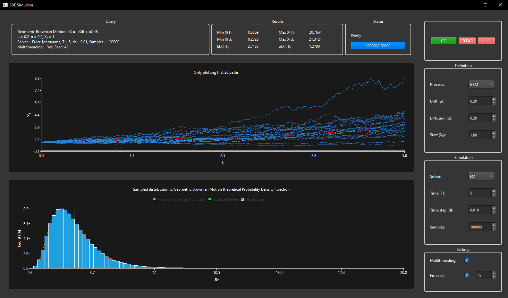

## Stochastic Differential Equation Simulator
A Windows based GUI program for simulating and visualising Stochastic Differential Equations (SDEs) using C++23.  
Based on the Qt framework.  
Supports Brownian Motion, Geometric Brownian Motion and Ornstein-Uhlenbeck processes.  
Supports Euler-Maruyama, Runge-Kutta and Milstein solvers.  
Supports non-blocking, multithreaded path sampling.  
Supports cancellation and progress monitoring.  


## Build Prerequisites
- CMake 3.22+
- VCPKG for QT6

## Build Instructions (Windows)

1: Clone the project into your repository
```bash
git clone https://github.com/Daniel-Sundae/SDE-simulator.git
```

2: Configure the project
```bash
cmake --preset release
```

3: Build the project
```bash
cmake --build --preset release
```

Find the executable at build/Release/StochasticSim.exe
and the test executable at build/Tests/Release/StochasticSimTests.exe
